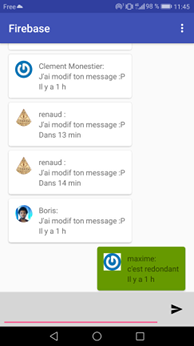
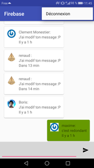
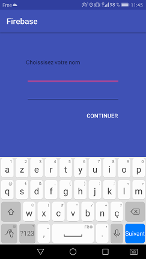

# Chat Firebase  

Application de chat sous Firebase en temps réel pour système Android

### Fonctionnalités:
  * Messagerie persistante avec base FireBase
  * Suppression des messages
  * Scroll automatique vers les nouveau messages  

### Installation :
1. Télécharger l'apk de la dernière [release](https://github.com/Hugbald/chatFirebaseAndroid/releases)
2. Transferer l'APK sur votre terminal android
3. executer l'APK

### Screenshots:

##### License:[GPLv3](https://github.com/owncloud/android/blob/master/LICENSE.txt)
